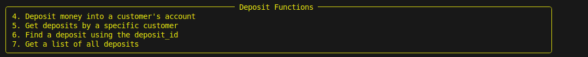
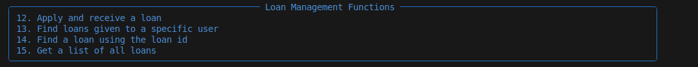
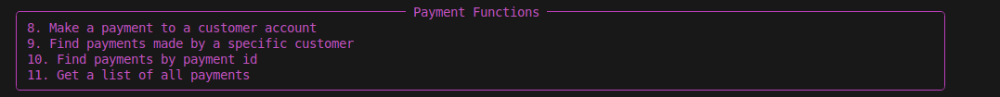
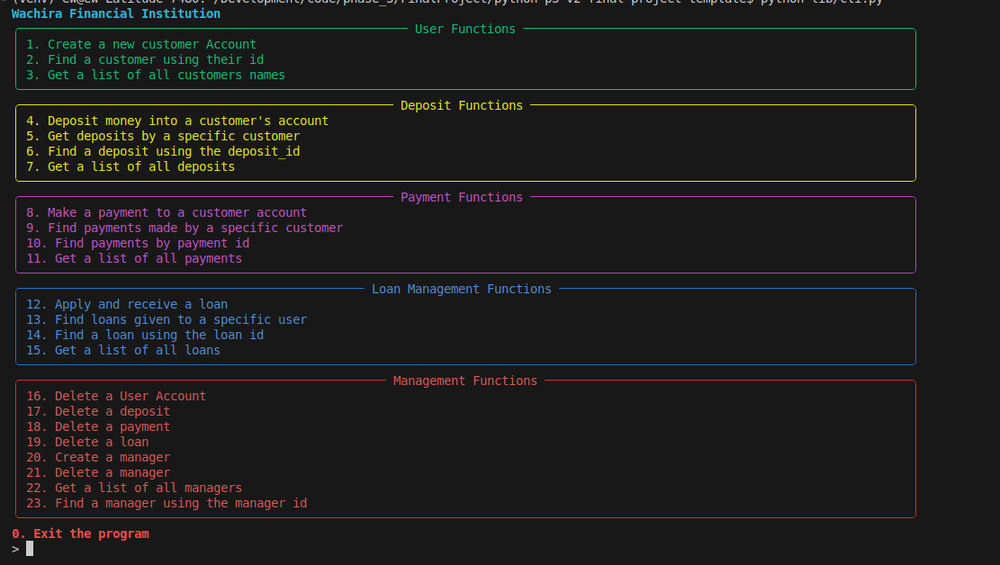

# Wachira Financial Institution

Welcome to Wachira Financial Institution's CLI Application. This application provides various functionalities for managing users, deposits, payments, loans, and managers.

## Table of Contents

- [Introduction](#introduction)
- [Problem Statement](#problem-statement)
- [Key Features](#key-features)
- [Minimum Viable Product (MVP)](#minimum-viable-product-mvp)
  - [MVP 1: Account Creation](#mvp-1-account-creation)
  - [MVP 2: Deposits](#mvp-2-deposits)
  - [MVP 3: Loans](#mvp-3-loans)
  - [MVP 4: Payments](#mvp-4-payments)
- [Installation](#installation)
- [Usage](#usage)
- [Screenshots](#screenshots)
- [Database Schema](#database-schema)
- [Contributing](#contributing)
- [License](#license)

## Introduction

This project is a command-line interface (CLI) application for managing various banking operations such as user accounts, deposits, payments, and loans. It aims to streamline the process by which banks allow their customers to manage their financial activities.

## Problem Statement

Many banks rely on outdated or siloed systems for managing customer accounts, transactions, and other core functionalities. These systems often lack integration, leading to inefficiencies, data inconsistencies, and a poor customer experience. Additionally, manual processes can be prone to errors and delays.

As a result, this project intends to create a bank system that will streamline the process by which banks allow their customers to make deposits, payments, receive loans, and keep track of user accounts.

## Key Features

- **User Management**: Create, find, and list users.
- **Deposit Management**: Make deposits, find deposits by user or ID, and list all deposits.
- **Payment Management**: Make payments, find payments by user or ID, and list all payments.
- **Loan Management**: Apply for loans, find loans by user or ID, and list all loans.
- **Manager Management**: Create, find, and list managers, and delete users, deposits, payments, loans, and managers.

## Minimum Viable Product (MVP)

### MVP 1: Account Creation

**Account Creation**:
- **User Registration**: Users can create a new bank account.
- **Date Recording**: The system records the date the account was created.
- **Customer ID Assignment**: Each customer is assigned a unique identifier used in all subsequent bank operations.

### MVP 2: Deposits

**Deposits**:
- **Record Deposits**: Users can record deposits made by customers into their accounts.
- **Update Account Balance**: Deposits increase the account balance accordingly.
- **Transaction Logging**: Each deposit transaction is logged with details such as amount and date.
 ## screenshot of deposit section
 


### MVP 3: Loans

**Loan Giving**:
- **Request Loans**: Users can request loans on behalf of customers.
- **Loan Approval**: The system processes loan requests and approves or rejects them based on predefined criteria.
- **Track Loans**: The system tracks the loan amount, date given, and the final amount expected to be repaid.
- **Update Account Balance**: Approved loans increase the customer's account balance.
- **Loan Repayment Tracking**: Basic tracking of repayments can be included.
## screenshot of Loan section


### MVP 4: Payments

**Payments**:
- **Make Payments**: Users can make payments from one customer account to another within the bank.
- **Transaction Processing**: The system processes payments and updates account balances accordingly.
- **Transaction Logging**: Each payment transaction is logged with details such as amount, date, sender, and recipient.
## screenshot of Loan section


## Installation

1. Clone the repository:
   ```sh
   git clone https://github.com/yourusername/wachira-financial-institution.git
   cd wachira-financial-institution
   code .  //to open the repo in vs code
  ```

## Usage
1. to launch the cli:
    ```sh
    python lib/cli.py
    ```
2. to select a comand just type in then click enter
you will see:

just type in the command then click enter
```sh
     // for example to exit you will enter 0
     > 0 // then click enter
```

## screenshots
on launching you will see:
  

## Database Schema

### User Table
| Column Name | Data Type  | Constraints |
|-------------|------------|-------------|
| user_Name   | Text       |             |
| User_id     | No         | PK          |
| Date        | Date/time  |             |

### Deposit Table
| Column Name      | Data Type  | Constraints |
|------------------|------------|-------------|
| Deposit_id       | No         | PK          |
| User_id          | No         | FK          |
| Deposit_Amount   | No (currency) |         |
| Deposit_date     | Date/time  |             |

### Payment Table
| Column Name             | Data Type     | Constraints |
|-------------------------|---------------|-------------|
| payment_id              | No            | PK          |
| User_Id                 | No            | FK          |
| User-id (payment made to) | No            |             |
| Payment_Amount          | No (currency) |             |
| Payment_Date            | Date/time     |             |

## Contributing
Ephy Wachira built this Cli Application
Contributions are welcome! Please follow these steps to contribute:
1. Fork the repository.
2. Create a new branch:
```sh
    git checkout -b feature/your-feature-name
```
3. Make your changes.
4Commit your changes:
```sh
    git commit -m 'Add some feature'
```
5. push to the branch
```sh
     git push origin feature/your-feature-name
```
6. Create a pull request.

  ### git Live Link 
  [ Ephy's Git](https://github.com/Ephymuiruri)
## license

This README template includes sections for Introduction, Problem Statement, Key Features, MVPs, Installation, Usage, Screenshots, Database Schema, Contributing, and License. Fill in the details and add your images where indicated. Adjust any sections as needed to better fit your project specifics.

